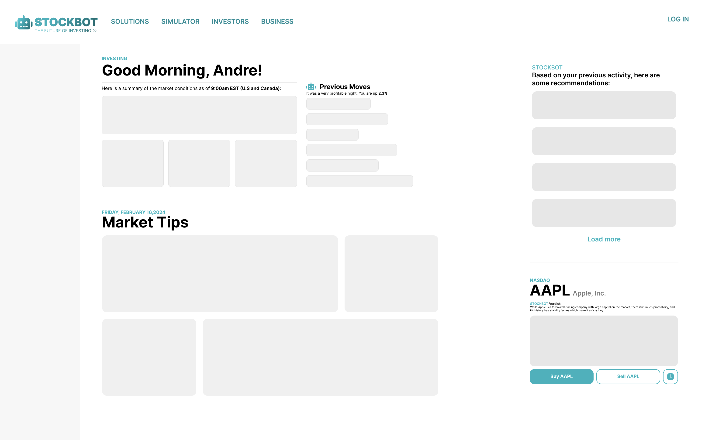
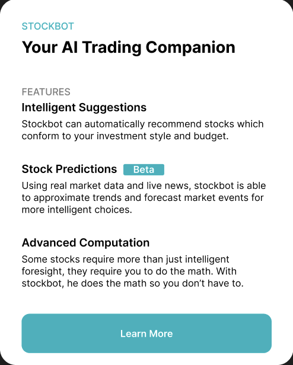
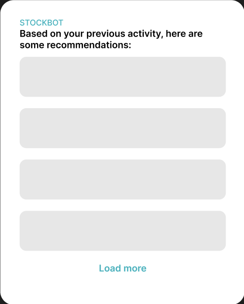
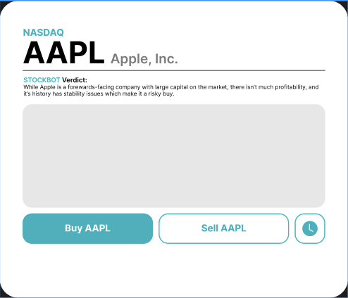

# STOCKBOT #

STOCKBOT is a stock trading platform designed to assist traders in making informed investment decisions. It provides insights, suggestions, and a user-friendly interface for easy trading. Whether you're a beginner or an experienced trader, STOCKBOT is here to help you navigate the stock market. 

## Features

- **Insightful Analysis:** Get in-depth analysis of stocks and market trends to make informed decisions.
- **Personalized Suggestions:** Receive personalized suggestions based on your trading preferences and risk tolerance.
- **User-Friendly Interface:** Enjoy a clean and intuitive interface for easy trading and monitoring of your investments.
- **Real-Time Updates:** Stay up-to-date with real-time stock prices and market news.
- **Secure Transactions:** Rest assured that your transactions and personal information are secure with our robust security measures.

## Getting Started

To get started with STOCKBOT, simply sign up for an account on our website and start exploring the world of stock trading. Our platform is designed to be user-friendly, so you can start trading with ease.

## Installation

If you have any questions or need assistance, create a new issue and I will get back to you.

## Contributing

I am actively looking for developers who are interested in contributing to the project. If you're passionate about stock trading and want to help improve STOCKBOT, please create an issue or fork the design and create a push request.

## Figma Mockups

 

